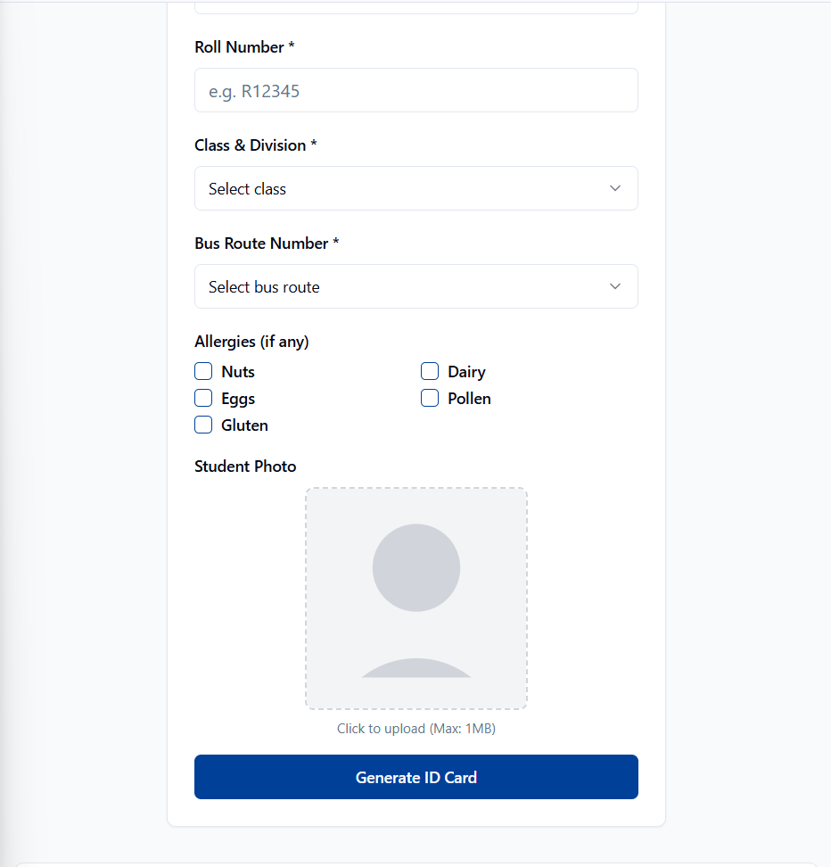
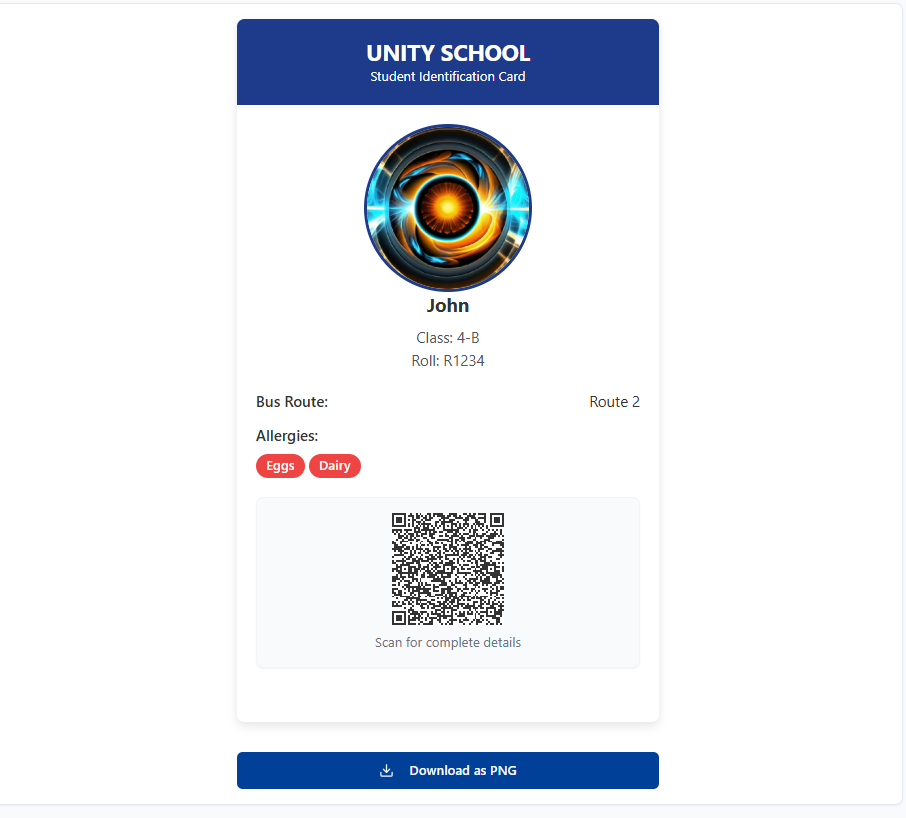
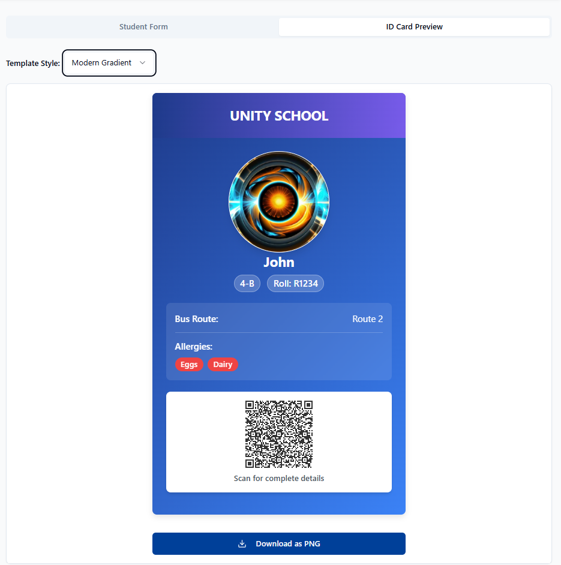

# Welcome to your Lovable project

## Project info

**URL**: https://lovable.dev/projects/d5b91e2a-9dee-48bb-92e8-2024ab0a1bea

# 🪪 Smart Student ID Card Generator

A ReactJS-based web app to generate customizable student ID cards. Easily input student details, preview the ID in real-time, and switch between professional templates. Built with persistent storage and designed for schools, colleges, and institutions.

## 🚀 Features

- 📝 Student Data Entry Form  
- 🖼️ Live ID Card Preview  
- 🎨 Template Switching (Multiple ID Designs)  
- 💾 Persistent Local Storage  
- ⚙️ Editable & Resettable Fields  
- 📱 Responsive Design (Works on Mobile & Desktop)

## 🛠️ Built With

- **ReactJS** + **TypeScript**
- **TailwindCSS** for styling
- **Replit** for deployment/testing
- **LocalStorage API** for persistence

## 📸 Screenshots

| Form Input | Live Preview | Template Options |
|------------|--------------|------------------|
|  |  |  |

## 🧑‍💻 How to Use

1. **Clone the Repository**
   ```bash
   git clone https://github.com/Vihas12/card-gen-genius
   cd card-gen-genius
